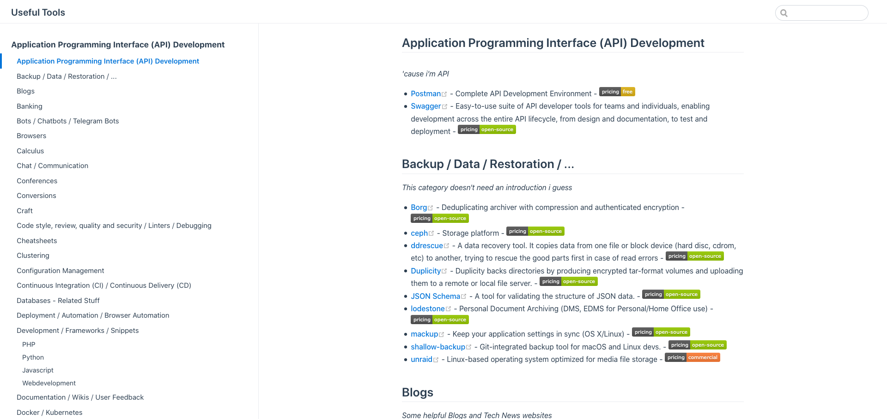

<!-- ALL-CONTRIBUTORS-BADGE:START - Do not remove or modify this section -->

<!-- ALL-CONTRIBUTORS-BADGE:END -->

# Useful Tools :mag_right: 

_A list of useful tools and programs for developpers, devops, admins, ... but not only.
Whereas most of them are Open Source, not all of them are. Please check licences that may apply.
This list contains items that i **personally** find useful, usages may differ._

The concept behind that list is based on the famous "[awesome](https://github.com/sindresorhus/awesome)" lists you can find on github. 
Since they did not fully suited my need, i preferred to go with my own version.

Please feel free to comment or open a pull request if you know better tools / or alternatives or if some links are dead, ... 😉

Thanks a lot to Algolia for providing the search mechanism through [docsearch](https://docsearch.algolia.com/) !

## Usage

You can either find the source [markdown file here](docs/readme.md), or access [the result here](https://trolologuy.github.io/useful-tools/).

To set it up locally:

For development mode:

1. Run `yarn install` to install all dependencies.
2. Run `yarn vuepress dev docs`
3. Open [http://localhost:8080/useful-tools/](http://localhost:8080/useful-tools/) in your browser.

To generate the static files:

1. Run `yarn install` to install all dependencies.
2. Run `yarn vuepress build docs`

To update the dependencies:
1. Run `yarn upgrade`

## Preview

## Contributors ✨

Thanks goes to these wonderful people ([emoji key](https://allcontributors.org/docs/en/emoji-key)):

<!-- ALL-CONTRIBUTORS-LIST:START - Do not remove or modify this section -->
<!-- prettier-ignore-start -->
<!-- markdownlint-disable -->
<table>
  <tbody>
    <tr>
      <td align="center" valign="top" width="14.28%"><a href="http://blog.9wd.eu"> <b>Felix Bartels</b></a> <a href="https://github.com/trolologuy/useful-tools/issues?q=author%3Afbartels" title="Bug reports">🐛</a> <a href="#projectManagement-fbartels" title="Project Management">📆</a></td>
      <td align="center" valign="top" width="14.28%"><a href="https://trolologuy.github.io/"> <b>trolologuy</b></a> <a href="#content-trolologuy" title="Content">🖋</a> <a href="https://github.com/trolologuy/useful-tools/commits?author=trolologuy" title="Documentation">📖</a></td>
      <td align="center" valign="top" width="14.28%"><a href="https://code.rosaelefanten.org"> <b>Cthulhux</b></a> <a href="#content-dertuxmalwieder" title="Content">🖋</a></td>
      <td align="center" valign="top" width="14.28%"><a href="https://deadc0de.re"> <b>deadc0de</b></a> <a href="#content-deadc0de6" title="Content">🖋</a></td>
      <td align="center" valign="top" width="14.28%"><a href="https://sobolevn.me"> <b>Nikita Sobolev</b></a> <a href="#content-sobolevn" title="Content">🖋</a></td>
      <td align="center" valign="top" width="14.28%"><a href="http://linkedin.com/in/roman-tezikov/"> <b>Roman Tezikov</b></a> <a href="#content-TezRomacH" title="Content">🖋</a></td>
      <td align="center" valign="top" width="14.28%"><a href="https://github.com/unbelauscht"> <b>unbelauscht</b></a> <a href="#content-unbelauscht" title="Content">🖋</a></td>
    </tr>
    <tr>
      <td align="center" valign="top" width="14.28%"><a href="https://github.com/cyr1l0u"> <b>cyr1l0u</b></a> <a href="#content-cyr1l0u" title="Content">🖋</a></td>
      <td align="center" valign="top" width="14.28%"><a href="https://semanticdiff.com/"> <b>Sebastian Lackner</b></a> <a href="#content-slackner" title="Content">🖋</a></td>
      <td align="center" valign="top" width="14.28%"><a href="http://www.rubenbuijs.nl"> <b>Ruben</b></a> <a href="#content-rubenbuijs" title="Content">🖋</a></td>
      <td align="center" valign="top" width="14.28%"><a href="https://github.com/CaioRolla"> <b>Caio Rolla</b></a> <a href="#content-CaioRolla" title="Content">🖋</a></td>
      <td align="center" valign="top" width="14.28%"><a href="https://github.com/gruelingpine185"> <b>gruelingpine185</b></a> <a href="#content-gruelingpine185" title="Content">🖋</a></td>
      <td align="center" valign="top" width="14.28%"><a href="https://github.com/antmorr"> <b>antmorr</b></a> <a href="#content-antmorr" title="Content">🖋</a></td>
      <td align="center" valign="top" width="14.28%"><a href="https://github.com/JonasHass"> <b>Jonass Hass</b></a> <a href="#content-JonasHass" title="Content">🖋</a></td>
    </tr>
    <tr>
      <td align="center" valign="top" width="14.28%"><a href="https://github.com/tomilomark"> <b>Tomilo Mark</b></a> <a href="#content-tomilomark" title="Content">🖋</a></td>
      <td align="center" valign="top" width="14.28%"><a href="https://martinstastny.com"> <b>Martin Stastny</b></a> <a href="#content-martinstastny" title="Content">🖋</a></td>
      <td align="center" valign="top" width="14.28%"><a href="https://github.com/tomzur"> <b>Tomzur</b></a> <a href="#content-tomzur" title="Content">🖋</a></td>
      <td align="center" valign="top" width="14.28%"><a href="https://github.com/definiteIymaybe"> <b>dfntlmb</b></a> <a href="#content-definiteIymaybe" title="Content">🖋</a></td>
      <td align="center" valign="top" width="14.28%"><a href="https://github.com/mariuszmichalowski"> <b>Mariusz Michalowski</b></a> <a href="#content-mariuszmichalowski" title="Content">🖋</a></td>
      <td align="center" valign="top" width="14.28%"><a href="https://taskade.com"> <b>John Xie</b></a> <a href="#content-johnxie" title="Content">🖋</a></td>
    </tr>
  </tbody>
</table>

<!-- markdownlint-restore -->
<!-- prettier-ignore-end -->

<!-- ALL-CONTRIBUTORS-LIST:END -->

This project follows the [all-contributors](https://github.com/all-contributors/all-contributors) specification. Contributions of any kind welcome!
